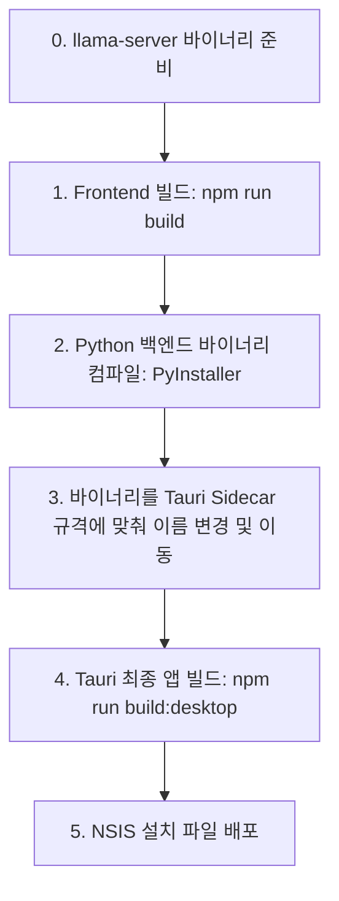

# 데스크톱 앱 배포 가이드라인 (Deployment Guide)

본 문서는 프론트엔드(React/Tauri)와 백엔드(Python FastAPI)가 결합된 하이브리드 데스크톱 애플리케이션을 단일 설치 파일로 번들링하여 배포하는 전체 과정을 가이드합니다.

---

## 1. 배포 빌드 워크플로우 개요

Windows 피드백 배포판을 빌드하는 흐름은 다음과 같습니다.



---

## 2. 세부 빌드 단계

### [0단계] 로컬 LLM 서버(llama-server) 바이너리 준비
앱 구동에 필요한 `llama-server.exe` 및 Vulkan 가속 관련 DLL을 사전에 다운로드하여 `src-tauri/bin/`에 배치합니다. 준비 스크립트를 실행하면 자동으로 처리됩니다.
```powershell
.\scripts\prepare_llama_server.ps1
```
(선택 사항) CUDA(NVIDIA) 전용 GPU 가속이 필요한 경우, `prepare_llama_server.ps1` 실행 후 cuBLAS 지원 DLL 묶음을 `src-tauri/bin/` 디렉토리에 수동으로 덮어씌워야 합니다. 기본적으로는 내장 그래픽 호환성이 좋은 Vulkan 빌드만 번들링합니다.

### [1단계] 프론트엔드 정적 파일 빌드
프론트엔드 리소스를 프로덕션 최적화 상태로 빌드합니다. 이 결과물은 `dist/` 폴더에 생성되며, Tauri가 패키징 시 이 폴더를 내장하게 됩니다.
```bash
npm run build
```

### [2단계] 파이썬 백엔드 컴파일
사용자 PC에 파이썬이 설치되어 있지 않아도 동작하도록, 백엔드 코드를 하나의 단일 실행 파일 바이너리로 빌드합니다.
```bash
cd python-backend
# PyInstaller 패키지 설치 (uv 권장)
uv pip install pyinstaller
# 단일 바이너리로 컴파일
uv run pyinstaller --onefile --name gws-backend main.py
```
* 결과물 파일: `python-backend/dist/gws-backend` (Windows: `gws-backend.exe`)

Windows 개발 환경에서는 저장소 루트에서 아래 스크립트로 2~3단계를 한 번에 수행할 수 있습니다.
```powershell
npm run build:backend
```
이 스크립트는 `uv`로 PyInstaller를 준비하고, 현재 `rustc` host target triple에 맞춰 `src-tauri/bin/gws-backend-[target].exe`로 복사합니다.

### [3단계] Tauri Sidecar 규격으로 이름 변경 및 배치
Tauri는 크로스 플랫폼 빌드를 위해, sidecar 바이너리 파일명 끝에 **[target triple]**(대상 플랫폼 식별자)이 붙는 것을 강제합니다.

1. 자신의 OS에 맞는 target triple 식별자를 확인합니다:
   * Windows (64bit Intel/AMD): `x86_64-pc-windows-msvc`
   * macOS (Apple Silicon M1/M2/M3): `aarch64-apple-darwin`
   * macOS (Intel): `x86_64-apple-darwin`
   * Linux (64bit): `x86_64-unknown-linux-gnu`

2. `src-tauri/` 하위에 `bin` 디렉토리를 생성하고, 빌드된 바이너리 파일을 이름 변경하여 이동시킵니다.
   * **Windows 예시**: `python-backend/dist/gws-backend.exe` -> `src-tauri/bin/gws-backend-x86_64-pc-windows-msvc.exe`
   * **macOS 예시**: `python-backend/dist/gws-backend` -> `src-tauri/bin/gws-backend-aarch64-apple-darwin`

### [4단계] Tauri 최종 패키징 빌드
모든 리소스와 백엔드 바이너리가 준비되었으므로, Tauri CLI를 사용하여 최종 Windows NSIS 설치 파일을 빌드합니다.
```bash
npm run build:desktop
```
* 빌드가 완료되면 `src-tauri/target/release/bundle/nsis/` 경로 아래에 설치 파일이 생성됩니다.

## 3. 피드백 배포 전 Windows smoke

피드백 사용자에게 보내기 전에는 아래만 확인합니다.

```powershell
npm run build:desktop
src-tauri\target\release\local-llm-gws.exe
Invoke-RestMethod http://127.0.0.1:18731/
Get-Process gws-backend -ErrorAction SilentlyContinue
```

- 첫 실행 후 화면 제목이 `Local LLM GWS`로 보이는지 확인합니다.
- 앱 종료 뒤 `gws-backend` 프로세스와 `18731` 리스너가 남지 않아야 합니다.
- Google 로그인/Drive 검색/RAG 상태 중 하나라도 실제 계정으로 한 번 눌러 봅니다.

---

## 4. 배포 설정 관리 (tauri.conf.json)

배포 빌드 시 sidecar가 제대로 포함되도록 `src-tauri/tauri.conf.json`의 `bundle` 설정을 확인해야 합니다.

```json
{
  "bundle": {
    "active": true,
    "targets": "all",
    "externalBin": [
      "bin/gws-backend"
    ]
  }
}
```
> [!IMPORTANT]
> `externalBin` 경로를 지정할 때 target triple 접미사는 제외하고 **`bin/gws-backend`**까지만 적어줍니다. Tauri 빌더가 실행 중인 플랫폼에 맞춰 자동으로 접미사를 붙여 실제 바이너리를 찾습니다.
